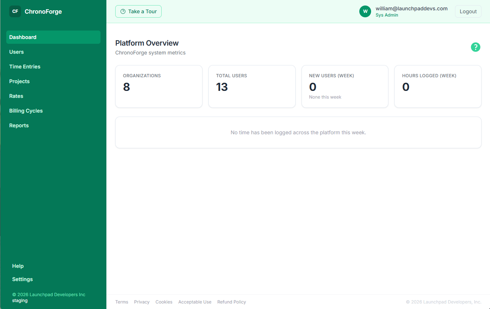
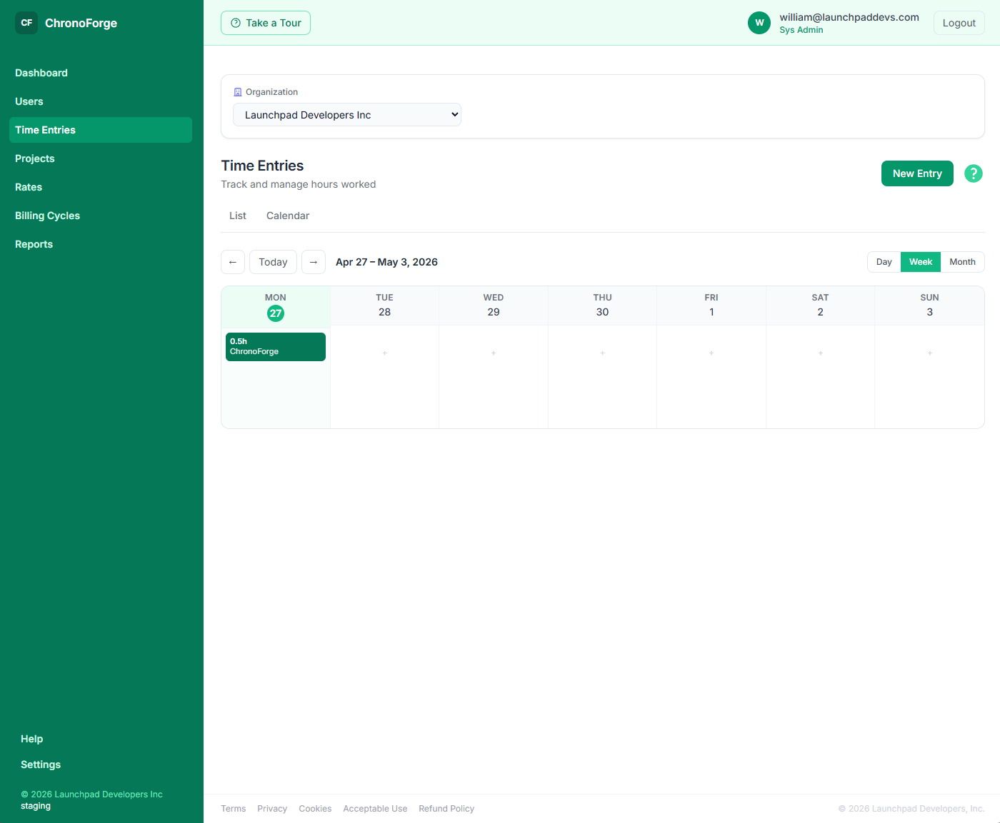
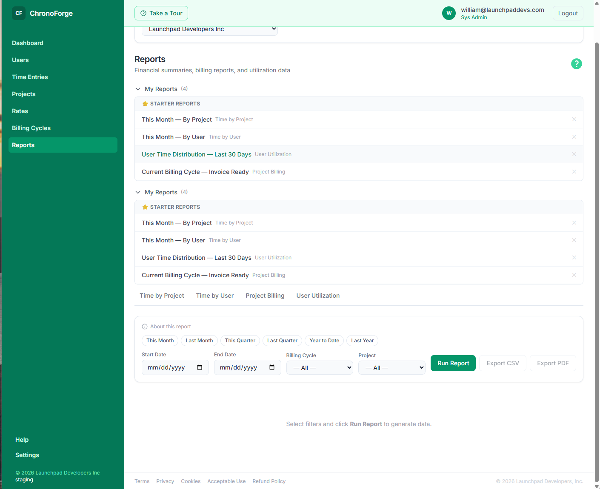
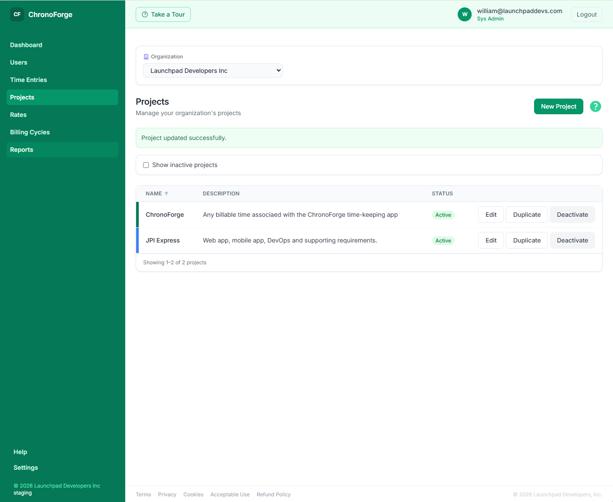
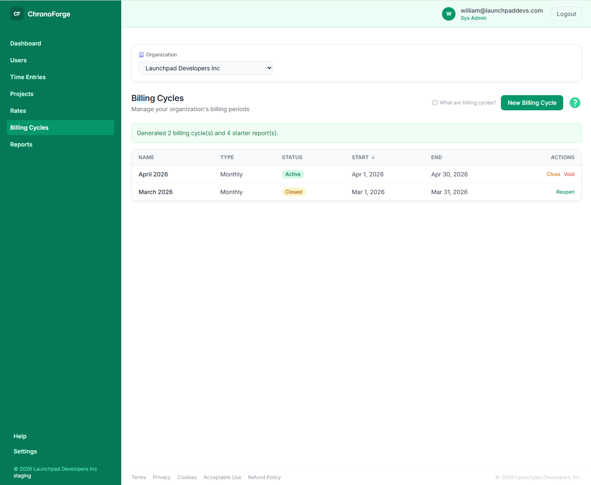
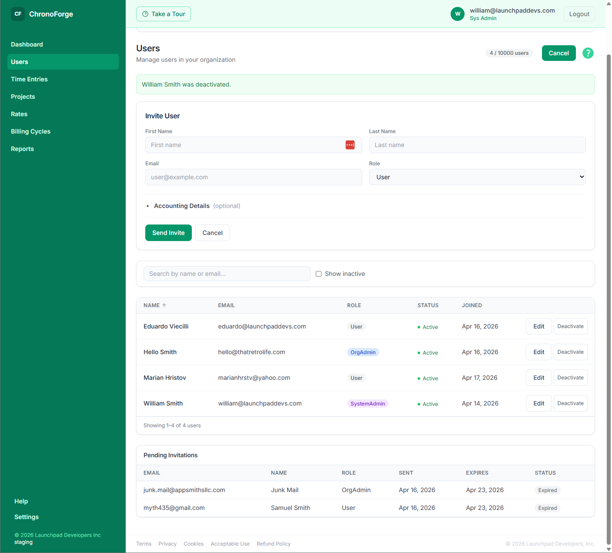

# ChronoForge

## 🔹 Leadership & Project Overview

ChronoForge is a **production-grade, multi-tenant SaaS platform** for time tracking, project billing, and team productivity management. Organizations use it to log billable hours, manage project rates, run billing cycles, and generate financial reports — all behind a clean, role-aware web interface.

The platform is live in production and designed to scale with the business: Stripe-backed per-organization subscriptions, GDPR-compliant legal flows, email-based self-service invitations, and a full security hardening pass against a formal threat model.

Built by **Launchpad Developers Inc.**, ChronoForge demonstrates what a well-architected SaaS product looks like when built from first principles: strict layering, no framework shortcuts, and a security model designed to hold up under scrutiny.

## 🧑‍💼 My Role

As the **sole designer and developer**, I:

- Architected the full seven-project layered solution from scratch on ASP.NET Core (.NET 10) and Blazor Server
- Designed the multi-tenant data model with org-scoped access enforced at the Application layer, never the database
- Built a separate `ApiClient` project — a typed HTTP client layer that keeps Blazor components entirely free of HTTP plumbing
- Designed and implemented a schema-first SQL migration system with idempotent scripts safe to run on every deploy
- Implemented a complete Stripe billing integration including per-organization plans, trial periods, webhook handling, and subscription-gated access control
- Designed the CI/CD pipeline strategy across five Azure Pipelines, including a production deployment gate requiring both a typed confirmation phrase and independent reviewer approval
- Authored 922 automated tests across unit, security, ApiClient, and Blazor bUnit suites
- Designed and implemented the UI using a custom design system built on Tailwind CSS with a no-border, tonal-layering aesthetic
- Produced the full documentation suite: architecture spec, feature docs, QA scripts, CI/CD guide, and a Postman collection with libraries and integration flow tests executed in the pipeline via Newman

## 🧭 Leadership Principles in Action

- **Designed for auditability** — the `ARCHITECTURE.md` file is the locked recovery point for every architectural decision, meant to survive any gap in development sessions
- **Security as a first-class constraint** — implemented a formal threat model (brute-force lockout, login timing normalization, invitation race-condition atomicity, cross-org isolation) before considering the product complete
- **Separation of concerns as a product quality strategy** — the `ApiClient` project exists not for elegance but because it makes every Blazor component independently testable without spinning up an HTTP server
- **Pipeline design reflects risk tolerance** — CI runs only on PRs (not every commit), production deployments require two independent gates, and database migrations have their own dedicated pipeline completely separate from code deployments
- **Financial invariants enforced architecturally** — billing rates are written as immutable snapshots on time entries at creation; they are never recalculated from mutable rate tables on read, preserving historical accuracy by design

## 🚀 Key Capabilities

- **Time Tracking** — log hours by date with notes, project assignment, and billable flag
- **Calendar View** — month, week, and day views for visualizing time entries with colour-coded projects
- **Project Management** — create and manage projects with hex colour coding and active/inactive status
- **Project Rates** — configure cost and billable rates per project with effective date bounds; rate snapshots written immutably to each time entry at creation
- **Billing Cycles** — open, activate, close, and void billing periods (monthly, quarterly, annual, custom)
- **Reports** — time by user, time by project, billing summary, and user utilization; CSV and PDF export
- **Saved Reports** — save report configurations and re-run on demand
- **Role-Aware Dashboard** — four distinct views for User, OrgAdmin, OrgOwner, and SystemAdmin roles, each loading only the data the role can see
- **User Management** — invite, activate, deactivate, and change roles per organization
- **Invitations** — email-based self-service signup with secure token acceptance flow and race-condition protection
- **Subscriptions & Billing** — Stripe-backed flat per-organization plans with trial period, cancel-at-period-end handling, and subscription-gated access control
- **Organization Settings** — org profile, accounting fields, and business info management
- **In-App Help** — searchable help articles with breadcrumb navigation
- **Onboarding Tours** — first-run feature walkthroughs per role
- **Legal & Compliance** — Privacy Policy, Terms of Service, GDPR data rights, and cookie consent
- **Security Hardening** — brute-force lockout, login timing normalization, invitation race-condition atomicity, password-reset timing protection, and cross-org reference validation

## 🧰 Tech Stack

- **API:** ASP.NET Core Web API (.NET 10) — thin controllers, all business logic in the Application layer
- **UI:** Blazor Server SSR (.NET 10) — server-side rendered with interactive islands where needed
- **Typed Client:** `ChronoForge.ApiClient` — dedicated project; all Blazor HTTP calls go through typed service interfaces, never raw `HttpClient`
- **Data Access:** Dapper 2.x — no Entity Framework by design; schema-first SQL migrations
- **Database:** Azure SQL (SQL Server LocalDB for local development)
- **Authentication:** Cookie-based session auth — no JWT, no ASP.NET Identity framework; PBKDF2/SHA512 password hashing
- **Payments:** Stripe — flat per-organization subscriptions, trial periods, webhook processing with idempotency log
- **Logging:** Serilog via `Launchpad.Observability` (zero-dependency, reusable internal package)
- **Secrets:** Azure Key Vault
- **Hosting:** Azure App Services
- **CI/CD:** Azure Pipelines — five pipelines (CI on PRs, CD to dev/staging/prod, dedicated prod DB migration); Newman runs Postman integration flows in CI with results published to the pipeline
- **Code Coverage:** ~75% of testable code covered; Coverlet + ReportGenerator produce an HTML coverage report published to Azure DevOps on every PR
- **Tests:** xUnit + Moq + bUnit — 922 tests across unit, security, ApiClient, and Blazor component suites
- **Design System:** Tailwind CSS — custom design language; Manrope typeface; no-border, tonal-layering aesthetic

## 📷 Screenshots

<table>
  <tr>
    <td align="center">
      
    </td>
    <td align="center">
      
    </td>
    <td align="center">
      
    </td>
  </tr>
  <tr>
    <td align="center">
      
    </td>
    <td align="center">
      
    </td>
    <td align="center">
      
    </td>
  </tr>
</table>

> See the [screenshots folder](./screenshots/) for full-resolution images.

## 🔐 Notes

ChronoForge is a proprietary SaaS product developed and operated by **Launchpad Developers Inc.**

- Full source is maintained in a private repository
- The platform is live in production
- This portfolio entry covers architecture, capabilities, and engineering decisions only

---

_© 2026 Launchpad Developers Inc. All rights reserved._
