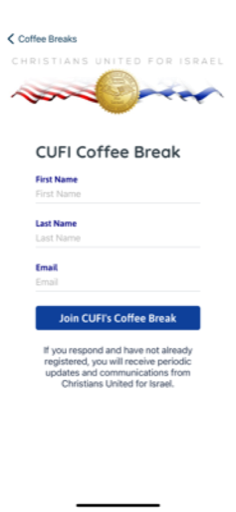

  

# CUFI Mobile

## 🔹 Leadership & Project Overview

CUFI Mobile is the official mobile application for **Christians United for Israel**, designed to keep both members and the general public informed about the organization's mission and ongoing efforts. The app provides timely news, video content, and personalized tools for users attending CUFI events throughout the year.

From daily media to real-time conference itineraries, CUFI Mobile bridges engagement and utility in one unified platform.

Developed by **Launchpad Developers Inc.**, the app reflects our commitment to technically sound, user-centric mobile software with strong leadership and product influence.

## 🧑‍💼 My Role

As the **Mobile Architect and Lead Developer**, I:

- Designed and implemented the cross-platform architecture using Xamarin.Forms
- Shaped user experience by directly contributing to wireframes and navigation flows
- Proposed and delivered embedded playback of **CUFI TV**, reducing reliance on third-party media platforms
- Led technical innovation on offline caching and local media handling to ensure smooth playback during conferences
- Collaborated closely with CUFI's design, media, and communications teams
- Delivered iterative builds to stakeholders with staging configurations and QA tools

## 🧭 Leadership Principles in Action

- Practiced **product influence**, suggesting and championing key feature shifts like embedded CUFI TV
- Maintained **technical clarity**, empowering less technical stakeholders to review and shape the product
- Built with **future scalability** in mind: flexible page routing, themed layouts, and modular components
- Balanced **feature ambition with delivery discipline**, ensuring conference deadlines were met without cutting corners

## 🚀 Key Capabilities

- News feeds, devotionals, and dynamic content libraries
- Embedded **CUFI TV** video streaming with offline fallback
- Social sharing integrations for news and campaigns
- Personalized push notifications with topic opt-ins (Summit, Alerts)
- Real-time action prompts for contacting legislators and local reps
- In-app inbox for notification history and reminders

## 🧰 Tech Stack

- **Frontend:** Xamarin.Forms (iOS & Android)
- **Backend:** RESTful API (CUFI-hosted)
- **Media:** Native embedded video player with fallback streams
- **Push:** Segmented push notifications (Firebase / Azure)
- **Storage:** SQLite for offline content caching and user preferences
- **CI/CD:** Managed builds and deployments via App Center

## 📷 Screenshots

<table>
  <tr>
    <td align="center">
      
    </td>
    <td align="center">
      
    </td>
    <td align="center">
      
    </td>
  </tr>
  <tr>
    <td align="center">
      
    </td>
    <td align="center">
      
    </td>
    <td align="center">
      
    </td>
  </tr>
</table>

> See the [screenshots folder](./screenshots/) for more UI examples. Sensitive content has been redacted where necessary.

## 🔐 Notes

CUFI Mobile is publicly available and can be downloaded from official app stores:

- [Download on the App Store](https://apps.apple.com/il/app/cufi/id1563118315)
- [Get it on Google Play](https://play.google.com/store/apps/details?id=com.cufi.mobile.app&hl=en_US&gl=US)

The repository includes select screenshots and redacted summaries only. Full source is proprietary.

All work was performed by **Launchpad Developers Inc** under contract with CUFI leadership.

---

_© 2025 Launchpad Developers Inc. All rights reserved._
