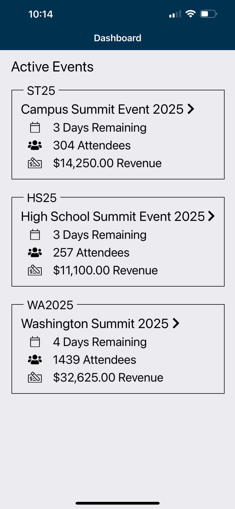
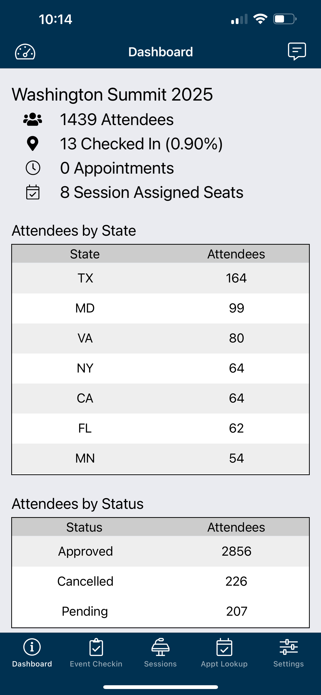
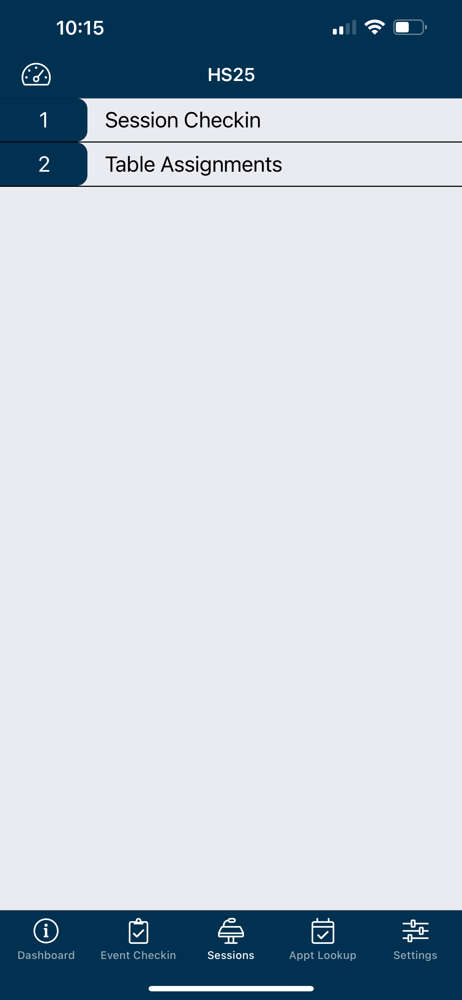
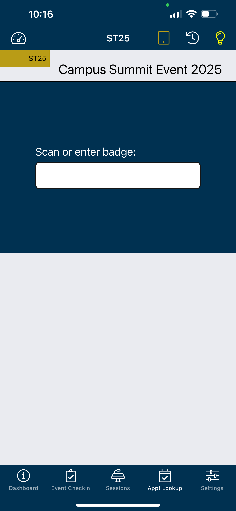
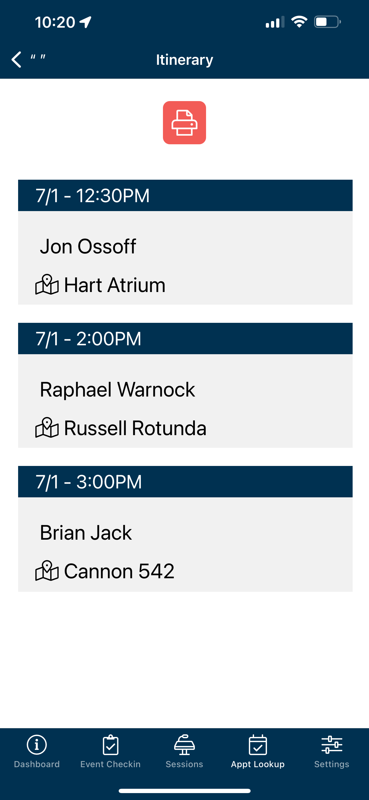

  

# EM3 Admin Mobile

## 🔹 Leadership & Project Overview

EM3 Admin Mobile is a cross-platform mobile application developed as part of the EM3 event management platform. Its goal: to empower both staff and patrons during high-volume events through intuitive tooling and robust kiosk support.

At Launchpad Developers Inc., we believe great software starts with great leadership. This project wasn’t just about delivering features—it was about architecting with clarity, leading with empathy, and making decisions that scaled with the team.

From field logistics to kiosk security, every implementation decision reflected the need for sustainability, maintainability, and performance under pressure.

## 🧑‍💼 My Role

As the **Lead Mobile Engineer and Architect**, I was responsible for both execution and technical leadership:

- Designed the mobile architecture using .NET MAUI (originally Xamarin.Forms)
- Led development of modular, offline-first workflows for patron support
- Architected kiosk mode with secure lockdown and self-healing refresh logic
- Integrated Azure B2C authentication with token refresh workflows
- Collaborated with backend teams to define clear, maintainable API contracts
- Drove CI/CD implementation with staged QA rollouts and diagnostic telemetry

## 🧭 Leadership Principles in Action

- Built for **clarity over cleverness**, enabling junior devs to contribute quickly
- Chose **offline-first patterns** to ensure field reliability, even in low-connectivity areas
- Ensured **role-based feature access** so different user types had tailored flows
- Practiced **technical empathy**, prioritizing readable code and clear error paths

## 🚀 Key Capabilities

- Secure admin login with biometric authentication
- Live event dashboards with attendee counts and status breakdowns
- Real-time session check-ins and seat/table assignments
- Badge scanning and manual entry for attendee verification
- Appointment lookups and itineraries for on-site staff
- Hardware integrations with external scanners and mobile device cameras

## 🧰 Tech Stack

- **Frontend:** Xamarin.Forms (iOS & Android)
- **Backend:** RESTful API (client-hosted)
- **Authentication:** Secure credential storage + biometric login
- **Hardware:** Barcode scanning with device camera + external reader support
- **Storage:** Local caching for offline lookups
- **CI/CD:** Managed builds and deployments via App Center

## 🧪 Testing & QA Delivery

- Unit testing with xUnit and Moq
- CI pipelines with environment-specific configs
- App Center distribution for QA and diagnostic feedback

## 📷 Screenshots

<table>
  <tr>
    <td align="center">
      
    </td>
    <td align="center">
      
    </td>
    <td align="center">
      
    </td>
  </tr>
  <tr>
    <td align="center">
      
    </td>
    <td align="center">
      
    </td>
    <td align="center">
      
    </td>
  </tr>
</table>

> See the [screenshots folder](./screenshots/) for more UI examples. Sensitive content has been redacted where necessary.

## 📄 Code Snippets

> Included with client permission. Browse `/snippets/` for patterns like:
> - Kiosk Lockdown Flow
> - Refresh Token Handling
> - Offline Sync Queuing

## 🔐 Notes

This is a privately listed app and cannot be downloaded by the general public.

This repo includes curated, redacted content only. Full source is proprietary.

All work was performed under contract by **Launchpad Developers Inc**.

---

_© 2025 Launchpad Developers Inc. All rights reserved._

