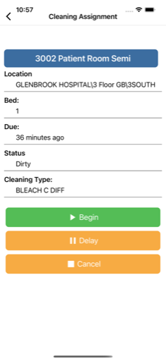

  

# Facility Fit: Assignments

**Facility Fit: Assignments** is an enterprise mobile app for managing patient room assignments and cleaning workflows in large medical facilities. The app supports HIPAA-compliant data flows, offline sync, dynamic cleaning types (like MRSA protocols), timers, and multi-state task workflows — all designed for real-world use by hospital staff.

---

## 🔹 Leadership & Project Overview

Facility Fit: Assignments is part of a larger suite of Facility Fit mobile apps. This project involved replacing a discontinued Cordova/Kendo UI solution with a robust, future-ready Xamarin.Forms build. I led every aspect of the rebuild — from initial architecture to field deployment — working directly with Aramark’s operations team to ensure the app matched real-world workflows and strict regulatory standards.

---

## 🧑‍💼 My Role

As the **Mobile Architect and Lead Developer**, I:
- Rebuilt the entire mobile app from scratch, referencing the legacy JavaScript only for API logic.
- Designed the offline-first data layer and sync routines.
- Implemented dynamic status tracking for assignments (*Not Started, In Progress, Delayed, Complete*).
- Integrated secure authentication and flexible server switching to support multiple staging/production environments.
- Added version check logic for proactive enterprise updates.
- Worked closely with stakeholders and field testers to refine usability.

---

## 🧭 Leadership Principles in Action

- **Ownership:** Took full responsibility for design, architecture, development, and deployment.
- **Customer Obsession:** Field-tested with real healthcare staff to match the cleaning workflow exactly.
- **Security & Compliance:** Ensured HIPAA requirements were met with secure auth and offline storage.
- **Bias for Action:** Delivered on tight deadlines to replace legacy apps before third-party support expired.
- **Operational Excellence:** Added version control prompts and environment switches to reduce rollout risk.

---

## 🚀 Key Capabilities

- HIPAA-compliant patient transfer and cleaning assignments.
- Offline sync for tasks, timers, and user actions.
- Dynamic cleaning workflows (e.g., *MRSA*, *BLEACH C DIFF*, UV sanitization).
- Multi-step status tracking: Begin, Delay, Complete.
- In-app version update checks.
- Secure login and server switching for staging/prod.

---

## 🧰 Tech Stack

- **Frontend:** Xamarin.Forms + Prism.Forms (MVVM)
- **Backend:** REST API (ASP.NET 4.5)
- **Sync:** Offline-first storage with SQLite
- **Notifications:** Azure Notification Hub
- **Auth:** Credential storage with environment switching
- **CI/CD:** MS App Center pipelines

---

## 📷 Screenshots

<table>
  <tr>
    <td align="center">
      
    </td>
    <td align="center">
      
    </td>
    <td align="center">
      
    </td>
  </tr>
  <tr>
    <td align="center">
      
    </td>
    <td align="center">
      
    </td>
    <td align="center">
      
    </td>
  </tr>
</table>

> See the [screenshots folder](./screenshots/) for more UI examples.

---

## 🔐 Notes

Facility Fit: Assignments is a privately listed enterprise app and cannot be downloaded by the general public.  
The repository includes select screenshots and redacted summaries only; full source is proprietary.  
All work was performed by **Launchpad Developers Inc.** under contract with Aramark Healthcare leadership.

---

_© 2025 Launchpad Developers Inc. All rights reserved._
