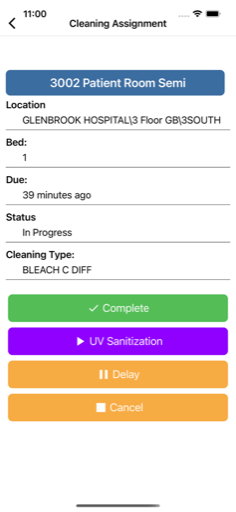

  

# Facility Fit: Assignments

**Facility Fit: Assignments** is an enterprise mobile app for managing patient room assignments and cleaning workflows inside large medical facilities. The app supports HIPAA-compliant data flows, offline sync, multi-step task handling, and dynamic infection control logic.

As the sole mobile engineer, I rebuilt Assignments from scratch, modernizing the legacy Cordova/Kendo UI solution into a robust Xamarin.Forms app. The original JavaScript served only as a rough reference for APIs and workflows — every feature was rebuilt by hand for performance and maintainability.

---

## 📌 **Key Highlights**
- Complete ownership of mobile design, architecture, and delivery.
- Built robust offline sync for patient room transfers and task status updates.
- Integrated real-time status tracking for assignments (*Not Started, In Progress, Delayed, Complete*).
- Implemented dynamic cleaning workflows for infection control (e.g., *MRSA*, *BLEACH C DIFF*).
- Added secure login with flexible server switching for multiple staging/prod environments.
- Developed in-app version check logic to manage enterprise-wide app updates.

---

## ⚙️ **Technical Details**
- Xamarin.Forms + Prism.Forms (MVVM)
- RESTful API (ASP.NET 4.5)
- Azure Notification Hub for push notifications
- CI/CD pipelines managed through MS App Center

---

## 📷 **Screenshots**

  
  
  

> See `/screenshots/` folder for more UI examples.

## 🔐 Notes

FacilityFit Assignments is a privately listed enterprise app and cannot be downloaded by the general public.

The repository includes select screenshots and redacted summaries only. Full source is proprietary.

All work was performed by **Launchpad Developers Inc** under contract with Aramark Healthcare leadership.

---

_© Launchpad Developers Inc. All rights reserved._

