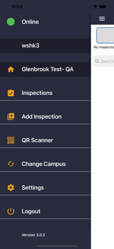
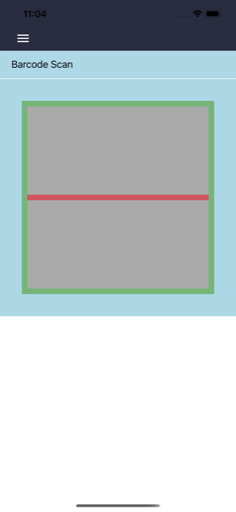
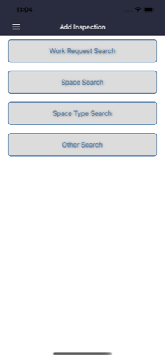
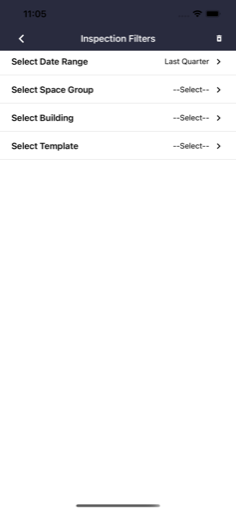

  

# Facility Fit: Inspections

**Facility Fit: Inspections** is a dynamic mobile app used by healthcare engineering and safety teams to manage on-site inspections and compliance reporting. Designed for flexibility and multi-campus support, the app uses XML-driven workflows, advanced filtering, and integrated barcode scanning to streamline field inspections in challenging environments.

---

## 🔹 Leadership & Project Overview

Facility Fit: Inspections replaced an outdated Cordova-based solution with a modern Xamarin.Forms app that is resilient, maintainable, and highly adaptable. I led the architecture and development from the ground up — transforming legacy JavaScript logic into a fully native experience, adding robust offline support, and integrating scanning capabilities for faster field operations.

---

## 🧑‍💼 My Role

As the **Mobile Architect and Lead Developer**, I:
- Designed and built the dynamic inspection engine using XML decision trees.
- Developed flexible search, filtering, and scan workflows.
- Integrated a QR/barcode scanning module for real-time asset lookups.
- Implemented multi-campus and environment switching.
- Ensured offline mode for inspections in low-connectivity areas.
- Aligned UI/UX with the broader Facility Fit suite for consistent branding.

---

## 🧭 Leadership Principles in Action

- **End-to-End Ownership:** Led the full rebuild, from architecture to deployment.
- **Practical Innovation:** Translated legacy static flows into dynamic XML-powered logic.
- **Customer Focus:** Tested scanning and offline features with real maintenance teams.
- **Operational Resilience:** Delivered robust error handling and multi-site support.
- **Technical Quality:** Maintained clean, maintainable code that can adapt to new inspection types.

---

## 🚀 Key Capabilities

- Dynamic XML-driven inspection workflows and forms.
- Offline-first data collection and sync.
- Multi-campus server switching.
- Integrated QR/barcode scanning for assets and spaces.
- Advanced search and filter tools (by date, space, template).
- Clear, branded user experience aligned with Facility Fit standards.

---

## 🧰 Tech Stack

- **Frontend:** Xamarin.Forms + Prism.Forms (MVVM)
- **Backend:** RESTful API (ASP.NET 4.5)
- **Scanner:** ZXing barcode integration
- **Sync:** SQLite for offline storage
- **Notifications:** Azure Notification Hub
- **CI/CD:** MS App Center pipelines

---

## 📷 Screenshots

<table>
  <tr>
    <td align="center">
      
    </td>
    <td align="center">
      
    </td>
    <td align="center">
      
    </td>
  </tr>
  <tr>
    <td align="center">
      
    </td>
    <td align="center">
      
    </td>
    <td align="center">
      
    </td>
  </tr>
</table>

> See the [screenshots folder](./screenshots/) for more UI examples.

---

## 🔐 Notes

FacilityFit Inspections is a privately listed enterprise app and cannot be downloaded by the general public.

The repository includes select screenshots and redacted summaries only. Full source is proprietary.

All work was performed by **Launchpad Developers Inc** under contract with Aramark Healthcare leadership.

---

_© 2025 Launchpad Developers Inc. All rights reserved._
