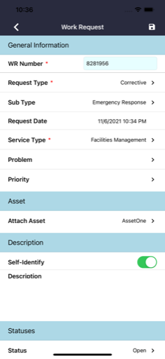

  

# Facility Fit: Maintenance

**Facility Fit: Maintenance** is an enterprise mobile application that empowers healthcare facility teams to manage work orders, track assets, and maintain compliance in critical medical environments.

As the sole mobile engineer, I converted the original Cordova-based solution to a robust Xamarin.Forms app. I rebuilt every workflow by hand, using the original JavaScript only as a reference for API contracts. I also shaped how the mobile app communicated with backend teams to handle offline sync, dynamic form rendering, and field data collection.

---

## 📌 **Key Highlights**
- Fully offline-capable work request creation, status updates, and upload confirmations.
- Deep work request detail forms: type, sub-type, service, assets, materials, contact info, photos.
- Integrated **time and wage tracking** for labor cost reporting (regular, overtime, travel).
- Asset management with barcode scanning, group linking, and search.
- Enterprise-grade **EULA acceptance flow** for legal compliance.
- Flexible server environment switching (test/staging/prod) built into login.
- End-to-end design, build, and delivery — shaped in collaboration with operations teams and field testers.

---

## ⚙️ **Technical Details**
- Xamarin.Forms + Prism.Forms (MVVM)
- RESTful API (ASP.NET 4.5)
- Azure Notification Hub for push
- CI/CD pipelines managed through MS App Center

---

## 📷 **Screenshots**

  
  
  

> See `/screenshots/` folder for more UI examples.

## 🔐 Notes

FacilityFit Maintenance is a privately listed enterprise app and cannot be downloaded by the general public.

The repository includes select screenshots and redacted summaries only. Full source is proprietary.

All work was performed by **Launchpad Developers Inc** under contract with Aramark Healthcare leadership.

---

_© Launchpad Developers Inc. All rights reserved._

