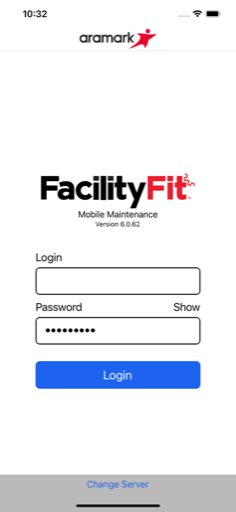
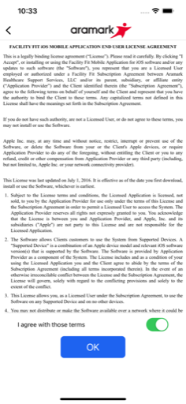
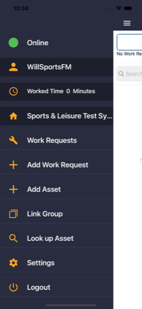
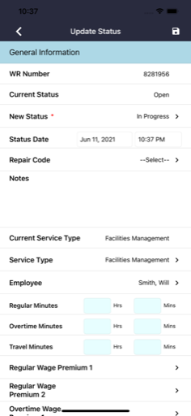

  

# Facility Fit: Maintenance

**Facility Fit: Maintenance** is an enterprise mobile application that empowers healthcare facility teams to manage work orders, track assets, and maintain compliance in critical medical environments.

---

## 🔹 Leadership & Project Overview

Facility Fit: Maintenance replaced an aging Cordova/Kendo UI app with a fully native Xamarin.Forms solution. As the sole mobile developer, I led the rebuild from the ground up — delivering a robust offline experience, dynamic asset tracking, and regulatory compliance features such as an EULA acceptance flow. I shaped the app’s workflows directly with Aramark’s operations teams, ensuring it solved real on-site challenges for maintenance and engineering staff.

---

## 🧑‍💼 My Role

As the **Mobile Architect and Lead Developer**, I:
- Rebuilt the full mobile application from scratch using Xamarin.Forms.
- Designed offline-first architecture for work requests and asset management.
- Integrated barcode scanning and dynamic search filters for field asset lookups.
- Implemented a time & wage tracking module for labor reporting.
- Added a legally compliant EULA flow tied to login and environment switching.
- Led direct collaboration with stakeholders to match live work order needs.

---

## 🧭 Leadership Principles in Action

- **End-to-End Ownership:** Managed all aspects of design, build, and delivery.
- **Trust & Compliance:** Delivered EULA flow and user security safeguards for an enterprise environment.
- **Practical Problem Solving:** Translated legacy logic into maintainable, modern code while extending functionality.
- **Customer Centricity:** Tested features in real-world settings with ops staff.
- **Technical Excellence:** Ensured offline sync, robust data validation, and error handling.

---

## 🚀 Key Capabilities

- Offline-capable work request creation, status updates, and uploads.
- Detailed work request forms: type, sub-type, assets, materials, photos.
- Time & wage tracking for labor cost control.
- Barcode scanning and dynamic search for assets.
- Group linking and asset relationships.
- Secure server switching and user authentication.
- EULA acceptance to support compliance audits.

---

## 🧰 Tech Stack

- **Frontend:** Xamarin.Forms + Prism.Forms (MVVM)
- **Backend:** RESTful API (ASP.NET 4.5)
- **Sync:** SQLite for offline storage
- **Notifications:** Azure Notification Hub
- **Scanning:** Built-in camera + external barcode reader
- **CI/CD:** MS App Center pipelines

---

## 📷 Screenshots

<table>
  <tr>
    <td align="center">
      
    </td>
    <td align="center">
      
    </td>
    <td align="center">
      
    </td>
  </tr>
  <tr>
    <td align="center">
      
    </td>
    <td align="center">
      
    </td>
    <td align="center">
      
    </td>
  </tr>
</table>

> See the [screenshots folder](./screenshots/) for more UI examples.

---

## 🔐 Notes

FacilityFit Maintenance is a privately listed enterprise app and cannot be downloaded by the general public.

The repository includes select screenshots and redacted summaries only. Full source is proprietary.

All work was performed by **Launchpad Developers Inc** under contract with Aramark Healthcare leadership.

---

_© 2025 Launchpad Developers Inc. All rights reserved._
