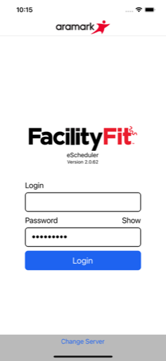
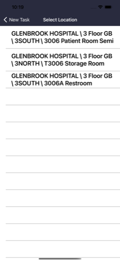

  

# Facility Fit: eScheduler

**Facility Fit: eScheduler** is an advanced scheduling tool that expands the Facility Fit suite by adding robust, real-time scheduling and multi-step task coordination for patient transfers and service tasks in large healthcare facilities.

---

## 🔹 Leadership & Project Overview

Facility Fit: eScheduler was built as a **net-new app** during the Facility Fit rollout to address advanced scheduling demands beyond the core Assignments functionality. I owned the mobile architecture and development end-to-end, collaborating with Aramark’s design, QA, and field operations teams to ensure the app’s UX, dynamic task logic, and real-time updates matched the complexity of real hospital operations.

---

## 🧑‍💼 My Role

As the **Mobile Architect and Lead Developer**, I:
- Designed and built the entire scheduling engine and dynamic workflows.
- Developed multi-area monitoring, role-based access, and status tracking.
- Integrated flexible server switching for staging, QA, and production.
- Built intuitive touch controls and status updates (Begin, UV Sanitization, Delay, Complete).
- Coordinated closely with QA and field testers to ensure real-world usability.
- Managed secure login flows, EULA acceptance, and environment config.

---

## 🧭 Leadership Principles in Action

- **Builder Mentality:** Took the lead in building this advanced module from scratch, aligned with enterprise standards.
- **Operational Focus:** Balanced dynamic scheduling features with practical usability for staff under time pressure.
- **Team Integration:** Worked cross-functionally with design, QA, and ops during iterative testing.
- **Security & Trust:** Added robust login, version checks, and multi-environment support for enterprise deployment.

---

## 🚀 Key Capabilities

- Dynamic scheduling logic layered on top of Facility Fit’s Assignments core.
- Multi-step task workflows with configurable statuses.
- Offline and online sync modes for dynamic field use.
- Real-time updates and visual task states.
- EULA acceptance and secure login with server switching.
- Designed for fast onboarding by non-technical field staff.

---

## 🧰 Tech Stack

- **Frontend:** Xamarin.Forms + Prism.Forms (MVVM)
- **Backend:** REST API (ASP.NET 4.5)
- **Notifications:** Azure Notification Hub
- **Sync:** SQLite for offline caching
- **CI/CD:** MS App Center pipelines

---

## 📷 Screenshots

<table>
  <tr>
    <td align="center">
      
    </td>
    <td align="center">
      
    </td>
    <td align="center">
      
    </td>
  </tr>
  <tr>
    <td align="center">
      
    </td>
    <td align="center">
      
    </td>
    <td align="center">
      
    </td>
  </tr>
</table>

> See the [screenshots folder](./screenshots/) for more UI examples.

---

## 🔐 Notes

FacilityFit eScheduler is a privately listed enterprise app and cannot be downloaded by the general public.

The repository includes select screenshots and redacted summaries only. Full source is proprietary.

All work was performed by **Launchpad Developers Inc** under contract with Aramark Healthcare leadership.

---

_© 2025 Launchpad Developers Inc. All rights reserved._
