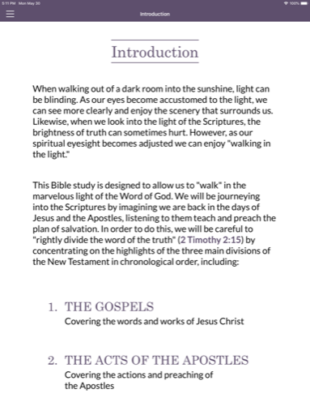

  

# Into His Marvelous Light (IHML)

**Into His Marvelous Light** is a multi-language interactive Bible study app built for broad global reach. It guides users through scripture with dynamic highlights, cross-references, and modern reading plans — all updated in real time without requiring app store updates.

Originally built with **Xamarin.Forms** and later migrated to **.NET MAUI**, this project leverages Google Firebase Realtime Database to deliver multilingual content dynamically. This lets the publisher push new translations instantly — every user’s local database auto-refreshes when the app detects a newer version.

This was a personal passion project: a collaboration between the publisher and myself to make life-changing study material accessible to anyone, anywhere.

---

## 🔹 Leadership & Project Overview

As the sole architect and developer, I:
- Designed the app’s architecture for easy maintainability and rapid content delivery.
- Integrated Firebase Realtime Database for seamless dynamic updates.
- Migrated the entire codebase from Xamarin.Forms to .NET MAUI to keep the app future-ready.
- Built multi-platform support targeting iOS and Android.
- Coordinated directly with the publisher for content versioning, visual design, and rollout.

---

## 🧑‍💼 My Role

- Sole developer and technical architect.
- Managed all mobile build pipelines and distribution.
- Handled Firebase setup, security rules, and real-time syncing logic.
- Designed the app’s user experience to be clean, scripture-focused, and intuitive.

---

## 🧭 Leadership Principles in Action

- **Innovation:** Chose Firebase to empower non-technical teams to release new languages on their own.
- **Ownership:** Fully owned the design, coding, testing, and deployment lifecycle.
- **Customer Focus:** Prioritized a gentle, distraction-free reading experience for diverse global audiences.

---

## 🚀 Key Capabilities

- Dynamic scripture highlight and reveal logic.
- In-app verse cross-references and popups.
- Multilingual support powered by Firebase.
- Automatic database syncing with zero user friction.
- Full offline reading.
- Clean, distraction-free visual theme and typography.

---

## 🧰 Tech Stack

- **Frontend:** .NET MAUI (originally Xamarin.Forms)
- **Backend:** Google Firebase Realtime Database
- **Build:** Manual pipelines via App Center and store submissions
- **Sync:** Local database caching and version control
- **Languages:** Multi-language XML delivered via Firebase JSON

---

## 📷 Screenshots

<table>
  <tr>
    <td align="center">
      
    </td>
    <td align="center">
      
    </td>
    <td align="center">
      
    </td>
  </tr>
  <tr>
    <td align="center">
      
    </td>
    <td align="center">
      
    </td>
    <td align="center">
      
    </td>
  </tr>
</table>

> See the [screenshots folder](./screenshots/) for more UI examples.

---

## 🔐 Notes

Into His Marvelous Light is publicly available and can be downloaded from official app stores:

- [Download on the App Store](https://apps.apple.com/us/app/into-his-marvelous-light/id1626900048)
- [Get it on Google Play](https://play.google.com/store/apps/details?id=com.ihml.mobile.prod&hl=en_US)

All content rights belong to the publisher.  
Development and maintenance by **Launchpad Developers Inc.** formerly **Appsmiths LLC**

---

_© 2025 Launchpad Developers Inc. All rights reserved._
