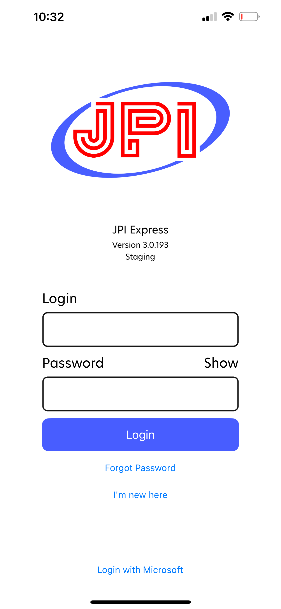
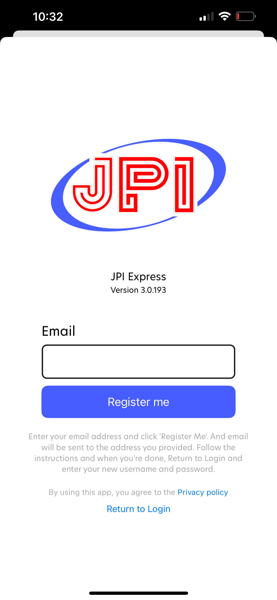
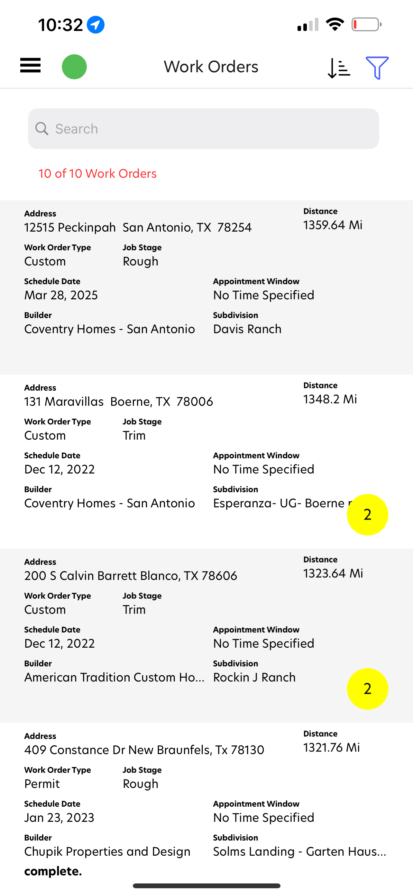
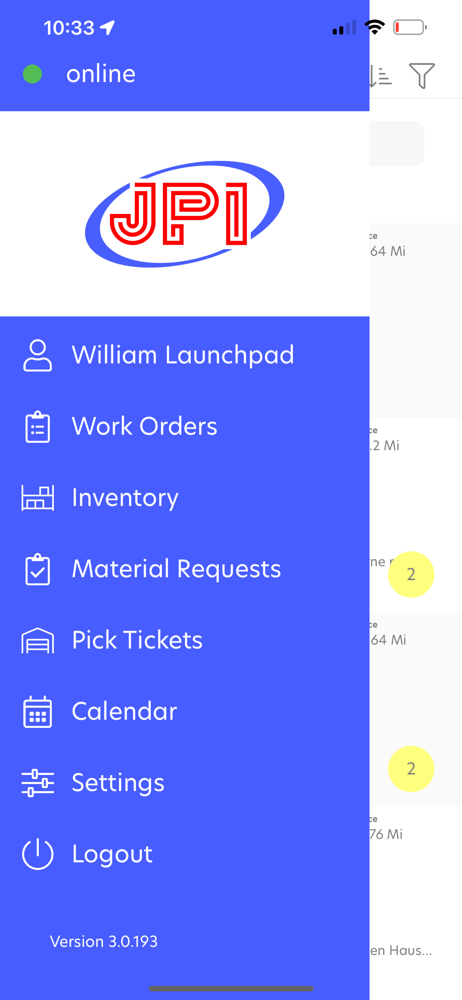
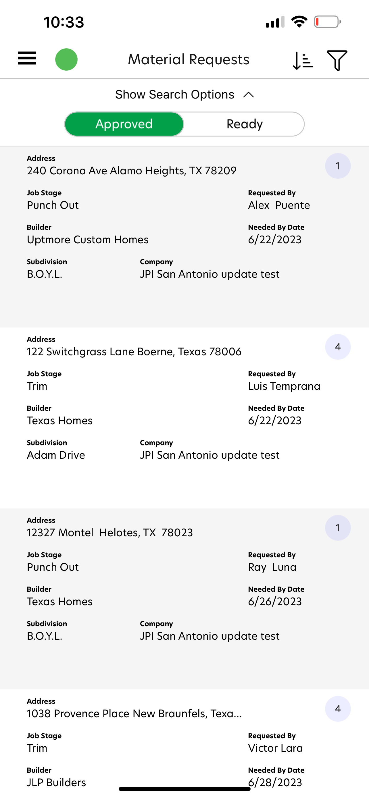
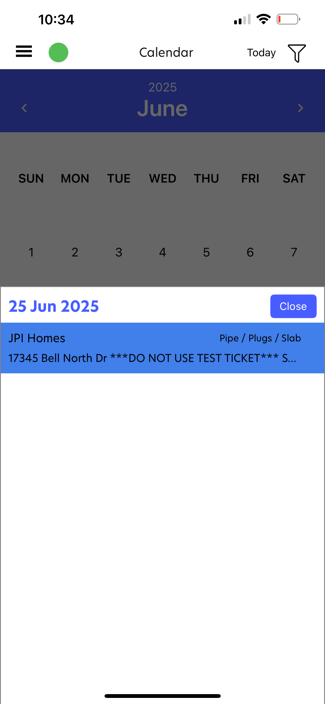

  

# JPI Express Mobile

**JPI Express Mobile** is an internal operations app for field crews and project managers. It streamlines daily tasks such as work order management, inventory tracking, material requests, calendar scheduling, and secure field signatures — all from a single mobile platform.

Built with **Xamarin.Forms** for iOS and Android, the project emphasizes offline-first reliability, easy authentication with Microsoft SSO, and a field-friendly user interface.

This was delivered as a high-impact enterprise tool under **Launchpad Developers Inc.**, demonstrating my direct leadership and technical execution in mobile development for operational efficiency.

---

## 🔹 Leadership & Project Overview

I was the **sole mobile developer** for JPI Express Mobile. I:
- Designed and implemented the entire cross-platform architecture.
- Influenced key user flows and screens to make the app practical for field use.
- Balanced tight timelines with maintainability and clear documentation.
- Coordinated directly with stakeholders to ensure workflows matched real-world field operations.

---

## 🧑‍💼 My Role

- Sole developer and technical lead for all mobile code.
- Contributed significant UX improvements and flow recommendations.
- Managed build and release pipelines using App Center.
- Implemented Microsoft SSO authentication, secure storage, and offline caching.

---

## 🧭 Leadership Principles in Action

- Balanced practical delivery with maintainability, resisting feature creep
- Proposed and guided improvements to login, settings, signature capture, and offline flows
- Communicated trade-offs clearly with stakeholders to keep the app realistic and useful
- Delivered multiple staging and production builds through App Center with CI configs

---

## 🚀 Key Capabilities

- Secure login with Microsoft SSO
- Work order management with status updates
- Material requests and pick ticket flow
- Signature capture for field confirmations
- Calendar and filter tools for scheduling
- Offline-first design for low connectivity environments

---

## 🧰 Tech Stack

- **Frontend:** Xamarin.Forms
- **Backend:** REST API (client-owned)
- **Auth:** Azure Active Directory / Microsoft Identity
- **Storage:** SQLite for offline data sync
- **CI/CD:** Azure DevOps + App Center

---

## 📷 Screenshots

<table>
  <tr>
    <td align="center">
      
    </td>
    <td align="center">
      
    </td>
    <td align="center">
      
    </td>
  </tr>
  <tr>
    <td align="center">
      
    </td>
    <td align="center">
      
    </td>
    <td align="center">
      
    </td>
  </tr>
</table>

> See the [screenshots folder](./screenshots/) for more UI examples.

---

## 🔐 Notes

JPI Express Mobile is a private enterprise app and is not publicly available. The source code is proprietary and not included.

All work was performed under contract by **Launchpad Developers Inc.**

---

_© 2025 Launchpad Developers Inc. All rights reserved._
