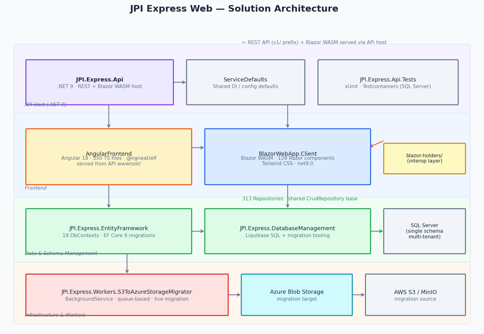
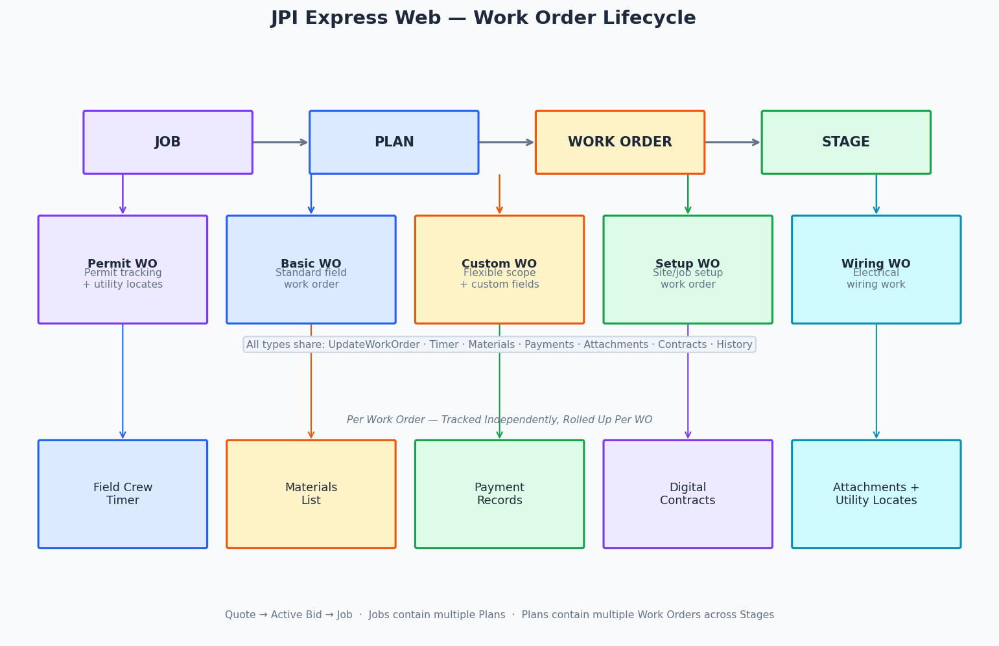
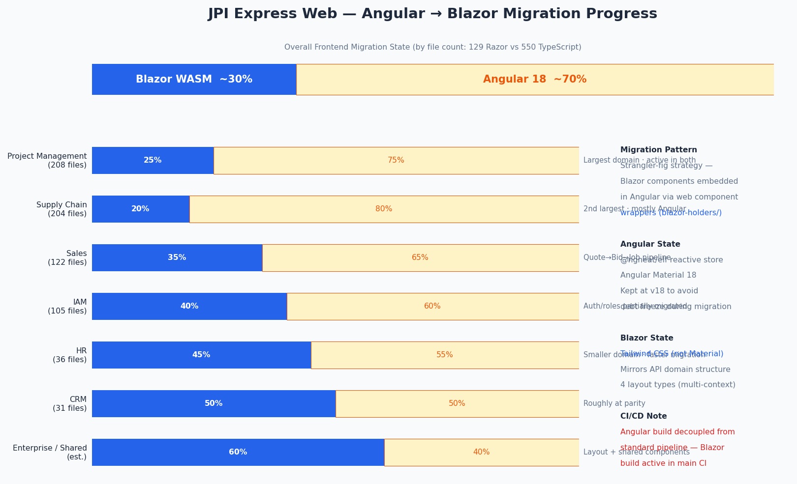
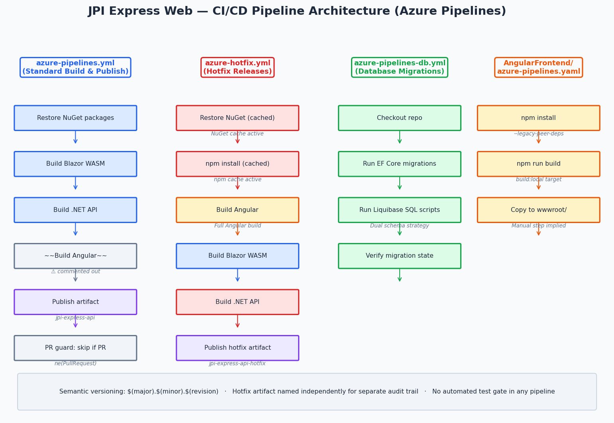
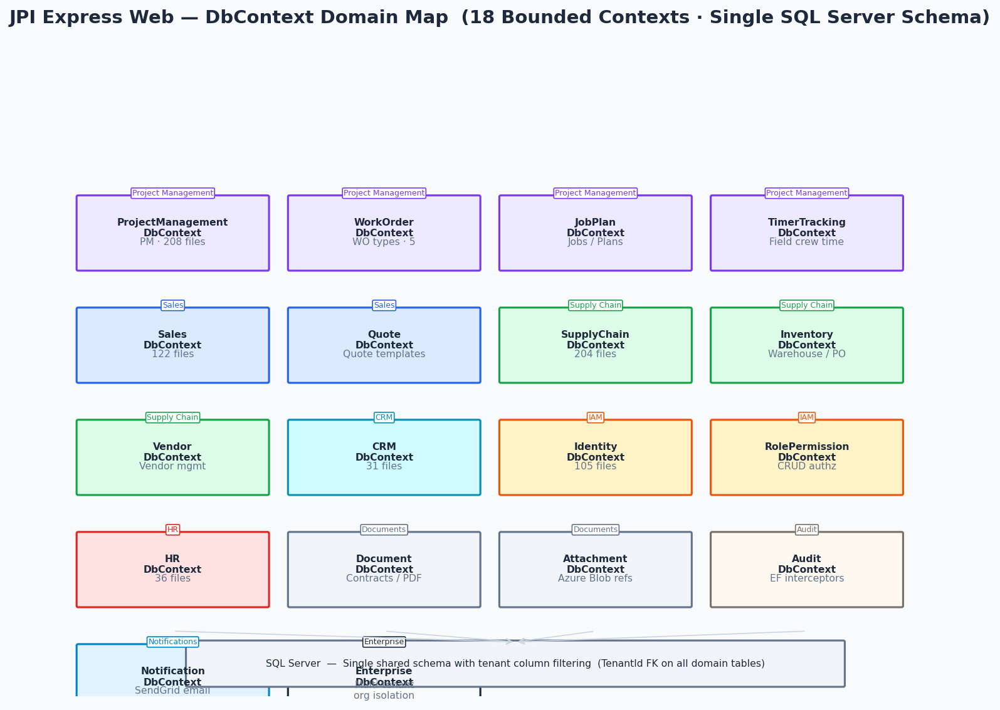
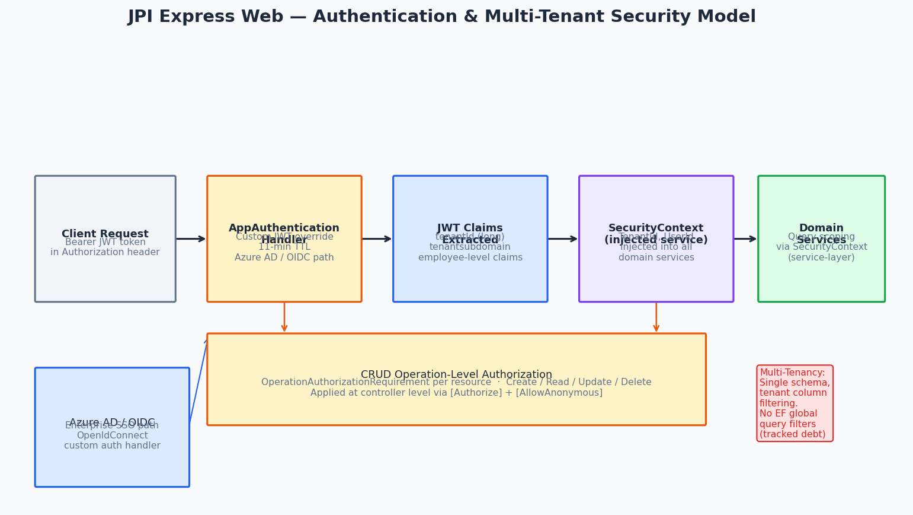
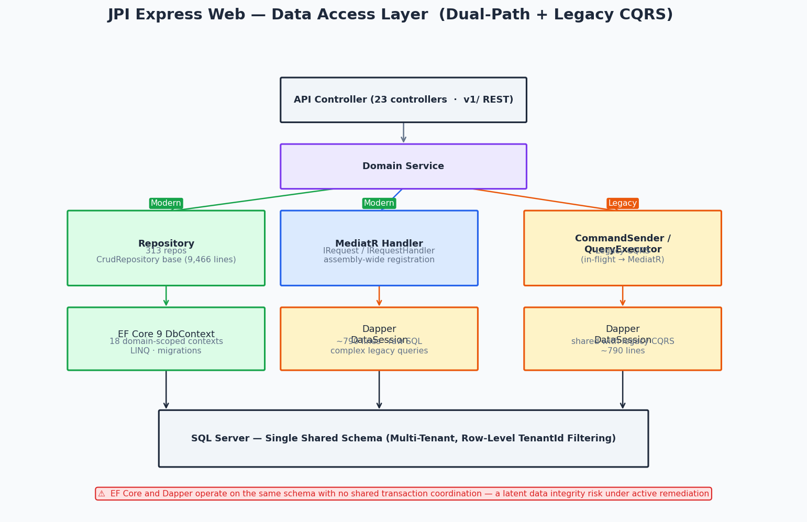

  

# JPI Express Web

**JPI Express Web** is an enterprise field operations and ERP platform serving a construction and installation company's full operational lifecycle — from estimating and sales through field execution, crew management, and supply chain. Built on **.NET 9** with a hybrid **Angular 18 + Blazor WebAssembly** frontend, the platform spans 21 business subdomains across a codebase inherited from multiple prior engineering teams.

This engagement was not greenfield development. It was **platform stabilization, modernization leadership, and delivery continuity** — evolving a complex operational system under active production use while managing four concurrent workstreams.

---

## 🔹 Leadership & Project Overview

JPI Express Web arrived with two prior teams' architectural decisions layered across a codebase of approximately 709,000 lines of C#. The mandate was deliberate modernization — not a rewrite — and maintaining production stability while advancing the platform toward a cleaner future state.

I established a formal **strangler-fig isolation strategy** for legacy code reduction, drove the Angular → Blazor WebAssembly migration through a non-disruptive interop pattern, and coordinated a live infrastructure migration from S3 to Azure Blob Storage — all while sustaining active feature delivery across 21 ERP domains.

---

## 🧑‍💼 My Role

- Lead engineer across backend modernization, frontend migration, and platform stabilization
- Designed and enforced the **`Legacy/` isolation strategy** — separating legacy CQRS patterns from modern MediatR-based domain modules
- Contributed to the Angular → Blazor transition using an interop-first `blazor-holders/` web component embedding approach
- Resolved a **release-blocking iOS AOT rendering bug** in the companion .NET MAUI mobile client — required deep platform-specific diagnosis
- Fixed a **work order data integrity defect** (`MaterialItems?.ToList() ?? []`) that was blocking the mobile save and complete workflow
- Stabilized transactional email delivery with **SendGrid suppression-aware** routing
- Maintained and extended four Azure Pipelines across standard build, hotfix, database migration, and Angular-specific CI paths
- Contributed to Testcontainers-based SQL Server integration test infrastructure

---

## 🧭 Leadership Principles in Action

- **Strangler-fig discipline:** Introduced an explicit `Legacy/` folder and naming convention to make technical debt visible, bounded, and systematically removable — rather than scattered and invisible
- **Non-disruptive migration:** Embedded Blazor components into live Angular pages via `blazor-holders/` web component wrappers — incremental replacement without a big-bang rewrite or user disruption
- **Release engineering:** Maintained separate standard and hotfix Azure Pipelines with distinct artifact naming and semantic versioning — recognizing that emergency patches require a different deployment path than routine releases
- **Platform infrastructure thinking:** Treated the S3→Azure migration worker as a first-class infrastructure concern — a standalone `BackgroundService` project isolated from business logic, with retry logic and per-batch safety thresholds running live against production
- **Debt transparency:** Kept 64 tracked TODO/HACK/FIXME markers in-code and visible — engineering culture of honest accounting over cosmetic cleanup

---

## 🏗️ Platform Architecture

Nine-project .NET solution with domain-bounded separation at every layer:

- **API:** .NET 9 monolithic API hosting REST endpoints and Blazor WASM; Angular 18 SPA served from `wwwroot/`
- **Data:** 18 domain-scoped EF Core DbContexts with isolated migrations per domain; 313 repositories backed by a shared `CrudRepository` base class
- **Schema management:** EF Core migrations + Liquibase SQL coordinated through a dedicated `DatabaseManagement` project
- **Infrastructure:** Standalone `BackgroundService` project for the live S3→Azure Blob document migration
- **DI:** Autofac 5.2 with each business domain registered as an explicit module (`PmDomain`, `SalesDomain`, etc.) — bounded context discipline enforced at the container layer, not just folder structure
- **Dual data access:** EF Core 9 for modern domain operations, Dapper (~790 lines) for legacy complex queries — parallel paths under active consolidation with no transaction bridge between them
- **Cross-cutting:** FluentValidation (auto-discovery), AutoMapper, and MediatR registered assembly-wide — platform-level standards enforced through configuration, not developer discipline

---

## 🔄 Modernization Strategy

The platform follows a deliberate **strangler-fig pattern** — new patterns deployed alongside legacy, legacy isolated but not deleted until fully replaced:

- **Backend domain logic:** ~60% modernized (EF Core + MediatR) vs. legacy (custom CQRS + Dapper) — in-flight, domain by domain
- **Frontend:** ~30% Blazor WebAssembly, ~70% Angular 18 by file count — Angular kept at current major version to avoid debt freeze during replacement
- **Infrastructure:** ~50% migrated — S3→Azure Blob worker running in production against live data
- **CI/CD:** Angular build decoupled from standard pipeline; Blazor-only build active for routine deploys

Migration workstreams running concurrently:

- **Legacy CQRS → MediatR:** Old `CommandSender`/`QueryExecutor` patterns coexist with new MediatR domain modules during in-flight transition
- **Dapper → EF Core:** Legacy queries being superseded domain by domain without a cutover event
- **Angular → Blazor WASM:** Blazor components embedded into Angular via web component wrappers; Tailwind CSS introduced as a deliberate break from Angular Material
- **S3 → Azure Blob:** Queue-based background worker migrating documents live — resumable, retry-capable, and independently deployable

---

## 🚀 Key Operational Capabilities

The platform manages 21 ERP subdomains across construction field operations:

- **Project Management** — Jobs → Plans → Work Orders (5 types) → Stages lifecycle with field crew timer tracking, utility locates, digital contracts, and per-work-order payment and material tracking
- **Sales Pipeline** — Quote → Active Bid → Job transition with versioned quote templates, labor rate management, and installation price catalog
- **Supply Chain** — Inventory management, warehouse operations, purchase order lifecycle, and vendor procurement with shopping cart
- **CRM** — Builder and homeowner contact management linked to work orders and job records
- **Identity & Access Management** — User, role, and permission management with CRUD operation-level authorization per resource
- **HR & Employee Management** — Employee records, position management, and compensation rate history
- **Document Operations** — PDF report generation, digital contract attachment and signing, media management via Azure Blob Storage
- **Transactional Email** — Suppression-aware SendGrid delivery — checks bounce and block lists before send to protect deliverability

---

## 🛠️ DevOps & Delivery

Four Azure Pipelines managing distinct deployment concerns:

- **`azure-pipelines.yml`** — Standard build and publish (Blazor + API; Angular build decoupled into separate pipeline)
- **`azure-hotfix.yml`** — Full build including Angular; formal hotfix release path with independent artifact names (`jpi-express-api-hotfix`)
- **`azure-pipelines-db.yml`** — Database migration pipeline gated independently from application deployments
- **`AngularFrontend/azure-pipelines.yaml`** — Standalone Angular CI pipeline

Delivery practices:

- Semantic versioning (`$(major).$(minor).$(revision)`) with named hotfix builds — formal emergency patch cadence
- PR guard on artifact publishing — PRs validate but do not produce deployment artifacts
- Docker Compose local dev environment (SQL Server + MinIO S3-compatible) — developer experience as a first-class concern
- Testcontainers-based integration tests — real SQL Server instances per test run for high-fidelity coverage

---

## 🔑 Authentication & Multi-Tenancy

- **JWT Bearer tokens** as primary auth with an 11-minute access token TTL — short-lived session design
- **Azure AD / OpenIdConnect** enterprise SSO path via a custom `AppAuthenticationHandler`
- **Multi-tenancy** via `TenantId` claim in JWT — row-level isolation applied through a `SecurityContext` service injected across all domain layers
- **CRUD operation-level authorization** using `OperationAuthorizationRequirement` per resource — not just route-level gating
- Tenant subdomain routing via JWT claims — subdomain-based tenant identification at the API level
- Tenant scoping via service-layer discipline; ORM-layer global query filter enforcement is a tracked remediation item

---

## 🧰 Tech Stack

- **Platform:** .NET 9 (ASP.NET Core, Blazor WebAssembly)
- **Frontend:** Angular 18 (TypeScript) + Blazor WebAssembly (Razor) — coexisting with a web component interop layer
- **ORM / Data:** Entity Framework Core 9, Dapper, SQL Server
- **DI Container:** Autofac 5.2 + Microsoft.Extensions.DependencyInjection
- **Patterns:** MediatR, FluentValidation (auto-discovery), AutoMapper
- **Auth:** JWT Bearer, Azure AD, OpenIdConnect
- **Observability:** NLog, OpenTelemetry (Azure Monitor)
- **Storage:** Azure Blob Storage (migrating from AWS S3)
- **Email:** SendGrid with suppression handling
- **PDF Generation:** IronPdf + WkHtmlToPdf
- **Testing:** xUnit, Testcontainers (SQL Server integration tests)
- **CI/CD:** Azure Pipelines (4 pipelines), Docker Compose (local dev)
- **Schema Management:** EF Core migrations + Liquibase SQL

---

## 📷 Screenshots

<table>
  <tr>
    <td align="center">
      
    </td>
    <td align="center">
      
    </td>
  </tr>
  <tr>
    <td align="center">
      
    </td>
    <td align="center">
      
    </td>
  </tr>
  <tr>
    <td align="center">
      
    </td>
    <td align="center">
      
    </td>
  </tr>
  <tr>
    <td align="center" colspan="2">
      
    </td>
  </tr>
</table>

> See the [screenshots folder](./screenshots/) for full-resolution diagrams.

---

## 🔐 Notes

JPI Express Web is a private enterprise application and is not publicly accessible. The source code is proprietary and not included in this repository.

All work was performed under contract by **Launchpad Developers Inc.**

---

_© 2026 Launchpad Developers Inc. All rights reserved._
