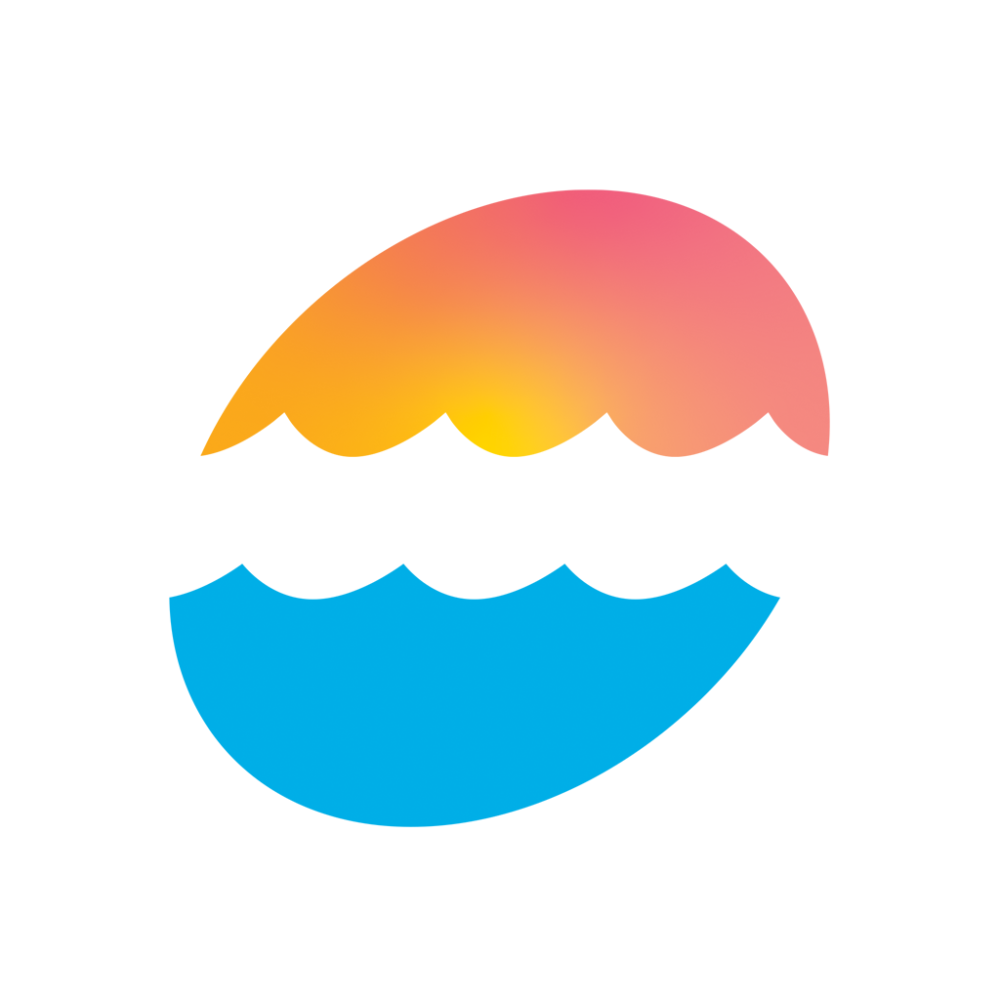
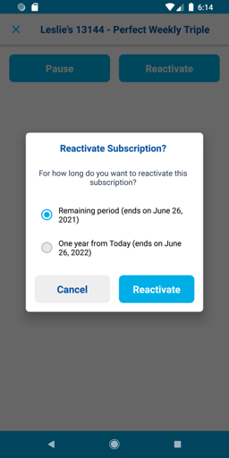
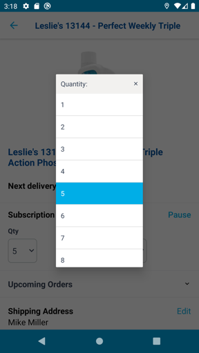
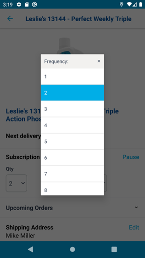

  

# Leslie's Pools Mobile Subscription Manager

**Leslie's Pools Mobile** is a cross-platform mobile app that lets pool owners manage their subscription deliveries with ease. The app enables customers to pause, reactivate, adjust, or skip upcoming shipments, pair with external pool water quality testers via Bluetooth, and use GIS/GPS features for store navigation and address lookup.

## 🔹 Project Purpose

- Give customers full control over pool supply subscriptions.
- Enable pausing or reactivating recurring deliveries with clear confirmations.
- Allow users to adjust quantities, frequencies, and delivery intervals quickly.
- Provide easy access to shipping address, payment method, and transaction history.
- Support pairing with Bluetooth water quality testers for accurate pool care.
- Integrate GPS and GIS to help customers locate nearby Leslie's Pool stores or warehouses and verify addresses.

## 🧑‍💼 My Role

- Sole mobile developer implementing subscription management, Bluetooth pairing flows, and GIS navigation logic.
- Collaborated with product and UX teams to refine user flows for pausing/reactivating and hardware integration.
- Integrated secure APIs for subscription updates and payment management.
- Led implementation of the store locator and address lookup features.

## 🚀 Key Features

- Pause and reactivate subscriptions with flexible date ranges.
- Adjust quantity, frequency, and time period for deliveries.
- View and edit shipping address and payment method.
- Pair and read data from Bluetooth pool water testers.
- Navigate to local stores and warehouses with integrated GPS/GIS tools.
- Address lookup for deliveries and store information.
- View upcoming delivery dates and skip shipments.
- Transaction history for full transparency.

## 🧰 Tech Stack

- **Frontend:** Xamarin.iOS and Xamarin.Android
- **Backend:** RESTful API for subscription management
- **Auth:** Secure token-based authentication
- **Bluetooth:** BLE integration for external water quality devices
- **GIS/GPS:** Integrated location services for store and warehouse navigation
- **Storage:** Local caching for user preferences and session 

## 📷 Screenshots

<table>
  <tr>
    <td align="center">
      
    </td>
    <td align="center">
      
    </td>
    <td align="center">
      
    </td>
  </tr>
  <tr>
    <td align="center">
      
    </td>
    <td align="center">
      
    </td>
    <td align="center">
      
    </td>
  </tr>
  <tr>
    <td align="center">
      
    </td>
    <td align="center">
      
    </td>
  </tr>
</table>

> See the [screenshots folder](./screenshots/) for more UI examples.

## 🔐 Notes

This app is publicly available on app stores, but proprietary, so no source code or internal snippets are shared.

- [Download on the App Store](https://apps.apple.com/us/app/leslies-pool-care/id1376878954)
- [Get it on Google Play](https://play.google.com/store/apps/details?id=com.lesliespool.mobile&hl=en_US)

All work performed by **Launchpad Developers Inc.**

---

_© 2025 Launchpad Developers Inc. All rights reserved._
