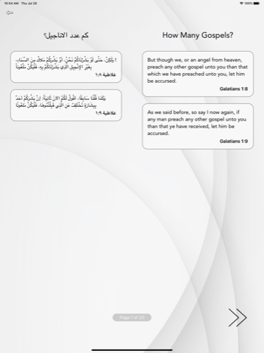
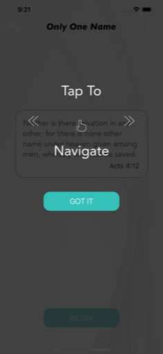

  

# Only One Name

**Only One Name** is an interactive Bible study app designed to reach diverse global audiences through **Parallel Learning** — allowing two languages to appear side-by-side, including full right-to-left script support. This unique feature helps teachers and students follow along together, no matter their native tongue.

Built originally with **Xamarin.Forms** and later migrated to **.NET MAUI**, the app uses **Google Firebase Realtime Database** to deliver lesson content dynamically. Publishers can add new languages instantly without forcing users to update from the store — the local database refreshes itself automatically when a new version is published.

This project was a passion collaboration between the Bible study author and myself, driven by a mission to make this message more accessible worldwide.

---

## 🔹 Leadership & Project Overview

As the sole architect and developer, I:
- Designed the app’s architecture with **Parallel Learning** as the core experience.
- Implemented Firebase Realtime Database for seamless dynamic language updates.
- Added RTL language support and custom UI logic for bidirectional layouts.
- Migrated the entire codebase from Xamarin.Forms to .NET MAUI to extend the app’s lifespan.
- Created intuitive onboarding tooltips to help first-time users navigate the study flow.

---

## 🧑‍💼 My Role

- Sole mobile developer and technical lead.
- Designed the complete user interface and flow independently.
- Managed Firebase security, structure, and syncing logic.
- Built custom tooltips and help overlays for easy first-time user adoption.
- Oversaw the build pipelines, testing, and App Store deployment.

---

## 🧭 Leadership Principles in Action

- **Innovation:** Developed custom **Parallel Learning** to support multiple scripts side-by-side.
- **Ownership:** Took full responsibility for concept, design, development, and release.
- **User Focus:** Delivered a clean, clutter-free reading experience with support for RTL scripts and clear navigation.

---

## 🚀 Key Capabilities

- **Parallel Learning:** Display two languages simultaneously.
- Right-to-left script support for Arabic and other RTL languages.
- Dynamic lesson updates delivered instantly via Firebase.
- Tooltips and overlays for smooth onboarding.
- Clean typography and intuitive swipe navigation.
- Full offline functionality with local database caching.

---

## 🧰 Tech Stack

- **Frontend:** .NET MAUI (migrated from Xamarin.Forms)
- **Backend:** Google Firebase Realtime Database
- **Build:** App Center pipelines, manual store submissions
- **Sync:** Realtime updates with local versioning logic
- **Languages:** JSON-based multilingual content with RTL handling

---

## 📷 Screenshots

<table>
  <tr>
    <td align="center">
      
    </td>
    <td align="center">
      
    </td>
    <td align="center">
      
    </td>
  </tr>
  <tr>
    <td align="center">
      
    </td>
    <td align="center">
      
    </td>
    <td align="center">
      
    </td>
  </tr>
</table>

> See the [screenshots folder](./screenshots/) for more UI examples.

---

## 🔐 Notes

**Only One Name** is currently available for iOS:

- [Download on the App Store](https://apps.apple.com/us/app/only-one-name/id1394381647)

_(The Android version is unavailable at this time.)_

All content rights belong to the author and publisher.  
Development and maintenance by **Launchpad Developers Inc.**

---

_© 2025 Launchpad Developers Inc. All rights reserved._
