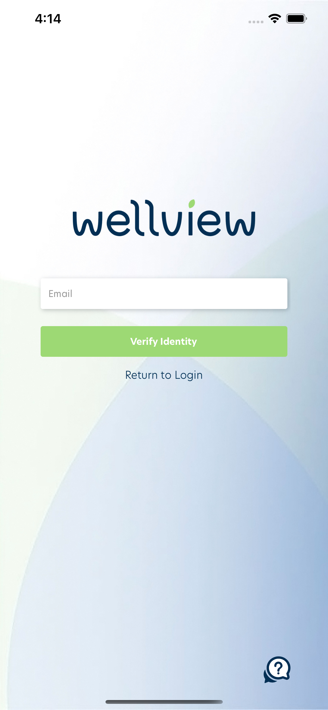
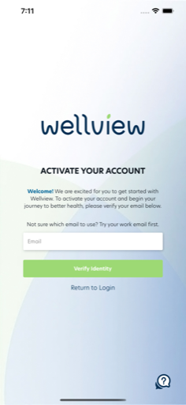
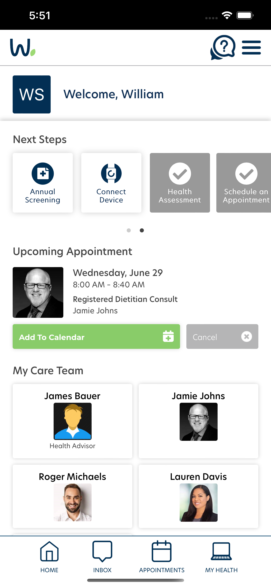
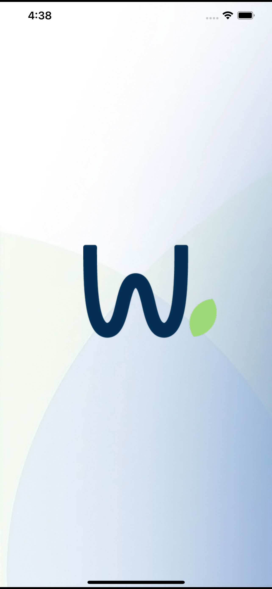
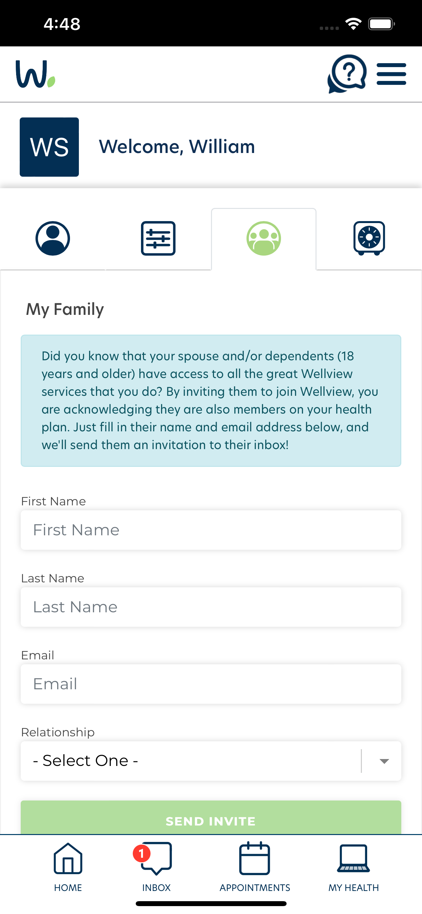
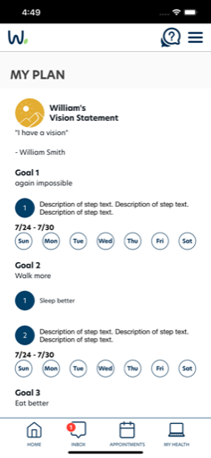

  

# Participant Mobile (Wellview / First Stop Health)

**Participant Mobile** is a secure, employer-sponsored mobile health platform originally branded as Wellview and now operating under **First Stop Health**. It empowers users to manage appointments, connect with care teams, track lab work, and access personalized wellness resources — all from a single, HIPAA-compliant app.

I developed this app using **Xamarin.Native** (**Xamarin.iOS** and **Xamarin.Android**) to ensure smooth, native experiences across both platforms. It includes dynamic account setup flows, secure authentication, and robust integrations with Wellview’s backend health management system.

---

## 🔹 Leadership & Project Overview

As the lead mobile developer, I:
- Rebuilt core features for login, account verification, and scheduling.
- Coordinated directly with Wellview’s backend and operations teams.
- Supported the rebranding transition to **First Stop Health**.
- Maintained HIPAA compliance across authentication and personal health info.
- Provided ongoing upgrades to the appointment system, care team communication, and resource modules.

---

## 🧑‍💼 My Role

- Sole Xamarin Native mobile developer.
- Architected iOS and Android project structure for maintainability.
- Implemented secure sign-in, MFA, and user data privacy.
- Integrated push notifications, lab integrations, and embedded content.
- Oversaw releases and app store submissions.

---

## 🧭 Leadership Principles in Action

- **Ownership:** Owned the app end-to-end from architecture to deployment.
- **Customer Obsession:** Delivered a clean, accessible UX for users navigating healthcare services.
- **Resilience:** Managed live updates and support while transitioning branding and legal requirements.

---

## 🚀 Key Capabilities

- Secure multi-step login and identity verification.
- Appointment scheduling and care team management.
- Lab screening and results tracking.
- Health assessment surveys and personalized plans.
- Push notifications and in-app messaging.
- Modern native design for iOS and Android.

---

## 🧰 Tech Stack

- **Frontend:** Xamarin.Native (Xamarin.iOS, Xamarin.Android)
- **Backend:** Secure REST APIs provided by Wellview / First Stop Health
- **CI/CD:** Managed with App Center pipelines
- **Compliance:** HIPAA-compliant data flows, MFA, secure auth

---

## 📷 Screenshots

<table>
  <tr>
    <td align="center">
      
    </td>
    <td align="center">
      
    </td>
    <td align="center">
      
    </td>
  </tr>
  <tr>
    <td align="center">
      
    </td>
    <td align="center">
      
    </td>
    <td align="center">
      
    </td>
  </tr>
</table>

> See the [screenshots folder](./screenshots/) for more UI examples.

> See the [snippets file](./snippets/snippets.md) for selected technical highlights.

---

## 🔐 Notes

Participant Mobile is a **Xamarin.Native** app using **Xamarin.iOS** and **Xamarin.Android** for full platform-specific performance and design consistency.

The app is publicly available on **iOS** and **Android**, but requires an account provided by participating employers and health providers.

- [Download on the App Store](https://apps.apple.com/us/app/first-stop-health/id1250975209)
- [Get it on Google Play](https://play.google.com/store/apps/details?id=com.firststophealth&hl=en_US)

All work was performed by **Launchpad Developers Inc.** under contract with Wellview (now First Stop Health).

---

_© 2025 Launchpad Developers Inc. All rights reserved._
