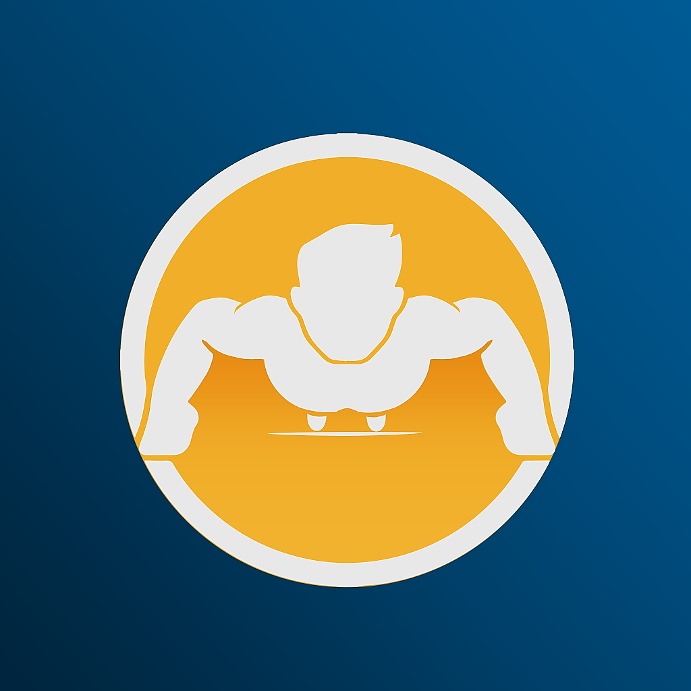

  

# Workout Tracking

**Workout Tracking** is a cross-platform fitness app designed to help users log, monitor, and analyze their strength training exercises and routines. The app provides an intuitive interface for tracking sets, reps, weights, and workout history, along with detailed exercise descriptions and progress graphs.

Built with **.NET MAUI**, the app delivers a seamless experience on iOS (currently available on the App Store) and was formerly supported on Android. It emphasizes ease of use, rich exercise data management, and progress visualization for fitness enthusiasts of all levels.

This project was **solely designed and developed** by me under **Launchpad Developers Inc**, with the complete source code included in this repository.

---

## 🔹 Key Features

- Add and categorize exercises by type, targeted body area, equipment, and difficulty level  
- Log workout sets with adjustable reps and weights  
- Filter exercises by category and search functionality  
- View detailed exercise descriptions with proper form instructions  
- Track workout history with date-stamped entries  
- Graphical visualization of one-rep max trends and progress over time  
- Create and manage custom workout routines  
- Supports Imperial and Metric measurement systems  
- Offline capable for workout logging without network connection

---

## 🧑‍💼 My Role

- Sole designer and developer of the entire cross-platform application  
- Implemented exercise logging, filtering, and routine management features  
- Developed data storage and synchronization using SQLite  
- Created progress tracking graphs and detailed workout history views  
- Managed app lifecycle, build, and deployment on iOS  
- Ensured intuitive UX and accessibility on mobile devices  

---

## 🧰 Tech Stack

- **Frontend:** .NET MAUI (iOS and formerly Android)  
- **Storage:** SQLite for offline data persistence  
- **Authentication:** None (public free app)  
- **CI/CD:** Manual build and deploy via Apple App Store  

---

## 📱 Availability

- **iOS:** Available for free on the [App Store](https://apps.apple.com/us/app/workout-tracking/id1524223523)  
- **Android:** Discontinued, no longer available on Google Play  

---

## 📷 Screenshots

<table>
  <tr>
    <td align="center">
      
    </td>
    <td align="center">
      
    </td>
    <td align="center">
      
    </td>
  </tr>
</table>

> See the [screenshots folder](./screenshots/) for additional UI examples.

---

## 🔐 Notes

This app is provided as-is for public use and is no longer supported or updated on Android. The iOS version remains available but is no longer actively maintained.

Full source code is included in the [source folder](./source/) for reference or continued development.

---

_© 2025 Launchpad Developers Inc. All rights reserved._
